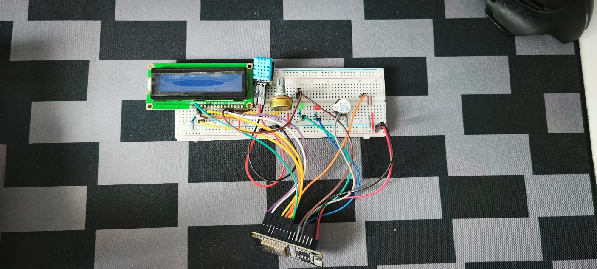
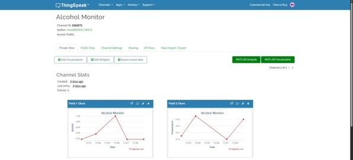
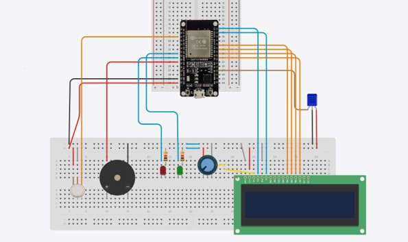

# ESP32 Alcohol Detector

## Описание на проекта

Проектът представлява система за експериментално откриване на алкохолни пари, изградена с ESP32. Тя използва сензор MQ-3 за отчитане на аналогов сигнал, свързан с наличието на алкохолни пари, и DHT11 за измерване на температурата на околната среда.

Измерените стойности се визуализират на LCD дисплей 16x2. При превишаване на зададения праг системата активира червен светодиод и зумер. Зелен светодиод показва нормално състояние. Данните се изпращат през Wi-Fi към платформата ThingSpeak.

## Използвани компоненти

* ESP32 DevKit
* MQ-3 — сензор за алкохолни пари
* DHT11 — температурен сензор
* LCD дисплей 16x2
* Червен и зелен светодиод
* Зумер
* Свързващи проводници и резистори

## Основни функционалности

* Отчитане на аналоговия сигнал от MQ-3
* Измерване на температурата чрез DHT11
* Визуализация на данните върху LCD дисплей
* Светлинна и звукова сигнализация
* Изпращане на данни към ThingSpeak през Wi-Fi
* Предупреждение при превишаване на зададения температурен праг

## Необходими софтуерни средства

* Arduino IDE
* ESP32 board support package
* DHT sensor library by Adafruit
* LiquidCrystal library
* ThingSpeak канал

## Стартиране на проекта

1. Отворете файла `ESP32-Alcohol-Detector.ino` в Arduino IDE.
2. Изберете подходящата ESP32 платка и сериен порт.
3. Конфигурирайте Wi-Fi данните и ThingSpeak Write API Key.
4. Свържете компонентите според електрическата схема.
5. Качете програмата върху ESP32.

**Важно:** Не публикувайте Wi-Fi пароли или API ключове в публичното хранилище.

## Забележка

Проектът е предназначен за учебни и експериментални цели. Стойността, изчислявана от MQ-3, не е калибрирано измерване на концентрацията на алкохол в кръвта или издишания въздух и не трябва да се използва за преценка дали човек може безопасно да шофира.
## Снимка на реалния проект

## Данни от ThingSpeak

## Електрическа схема

